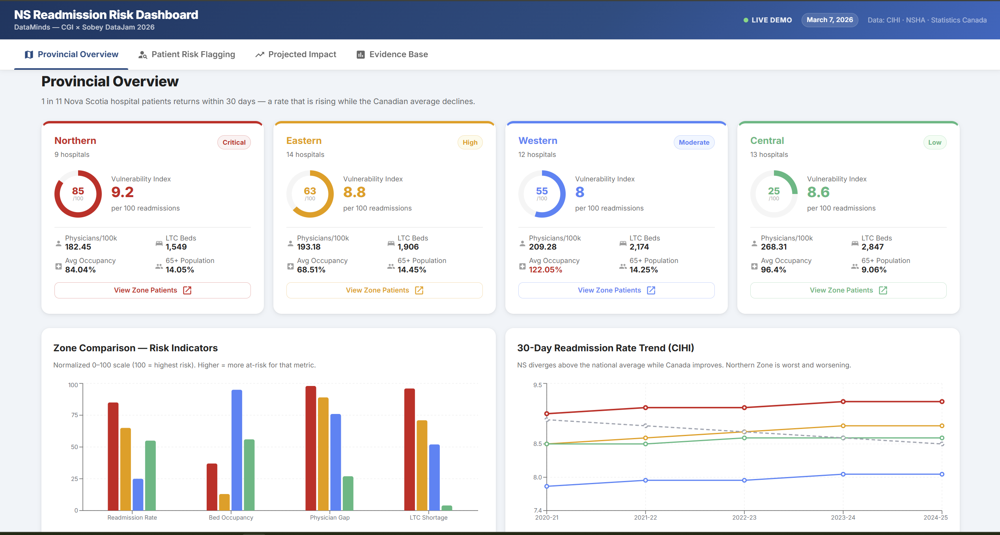
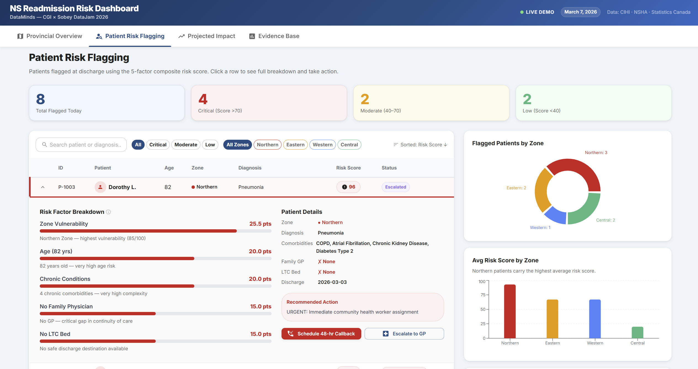
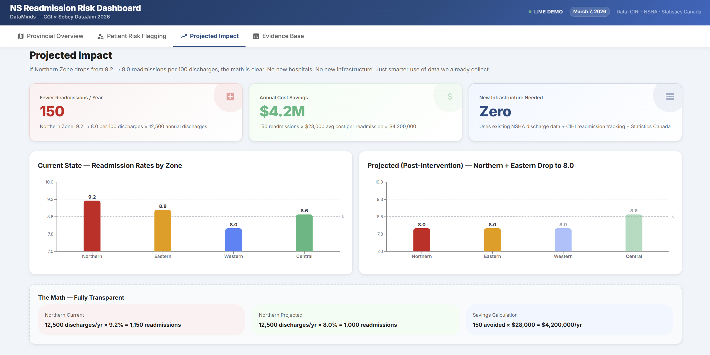
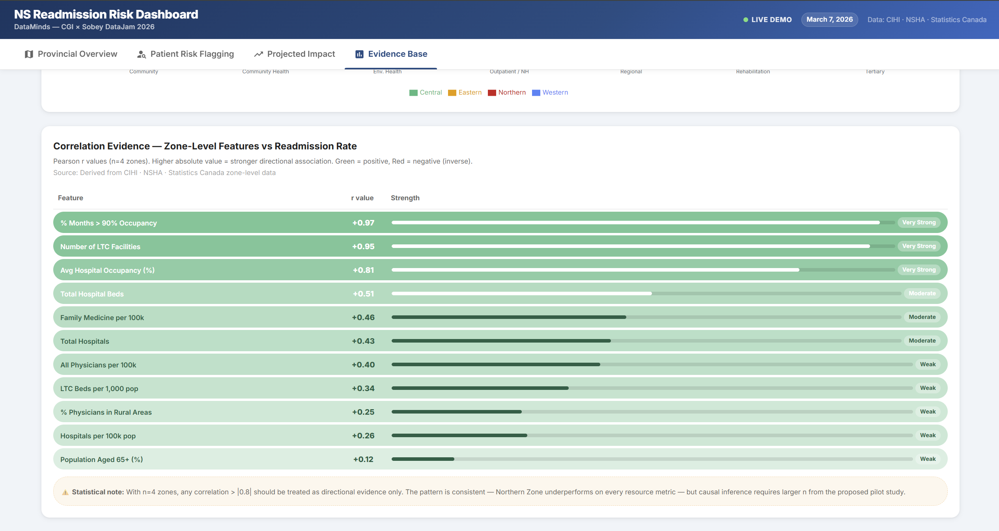

# NS Readmission Risk Dashboard

**DataMinds — CGI × Sobey DataJam 2026**

[](https://datajam-dataminds.netlify.app/)
[](https://reactjs.org/)
[](https://mui.com/)
[](https://vitejs.dev/)

---

## What Is This Project?

An interactive, single-page analytics dashboard that visualizes **Nova Scotia's 30-day hospital readmission risk** across all four health zones — built for the CGI × Sobey DataJam 2026 competition.

- **Problem**: 1 in 11 Nova Scotia hospital patients returns within 30 days — a rate that is rising while the Canadian average declines
- **Scope**: 4 health zones — Northern (Critical), Eastern (High), Western (Moderate), Central (Low)
- **Data sources**: CIHI Discharge Abstract Database, Nova Scotia Health Authority open data, Statistics Canada
- **Approach**: A 5-factor composite vulnerability index combining occupancy, LTC bed availability, physician access, population age, and family medicine coverage
- **Key anomaly identified**: Western Zone has the highest occupancy (122%) yet the *lowest* readmission rate — pointing to a physician-to-patient ratio advantage, not beds
- **Projection**: Dropping Northern + Eastern zones from 9.2 → 8.0 readmissions per 100 discharges avoids **150 readmissions/year** and saves **$4.2M annually**
- **Infrastructure required**: Zero — uses only existing NSHA discharge data + CIHI tracking + Statistics Canada
- **No machine learning, no black box**: every score, weight, and formula is shown inline on the dashboard
- **Built for decision-makers**: designed for health administrators, policy teams, and front-line discharge planners, not data scientists

---

## Dashboard Pages

### 1 — Provincial Overview
Zone-level cards with vulnerability index scores, a normalized risk comparison chart across 4 indicators, and a 5-year CIHI readmission trend line showing Nova Scotia diverging from the national average.



---

### 2 — Patient Risk Flagging
Filterable patient table flagging individuals at discharge using the composite risk score. Each row expands to show a full factor breakdown and recommended actions (GP callback, care coordinator, social worker escalation).



---

### 3 — Projected Impact
Before/after comparison charts with transparent math: exactly how 150 avoided readmissions and $4.2M in annual savings were calculated, broken down by discharge volume and average cost per readmission.



---

### 4 — Evidence Base
Correlation evidence table (Pearson r values, n=4 zones) showing % months >90% occupancy and LTC facility count as the two strongest directional predictors of readmission rate, with statistical notes on effect interpretation.



---

## Installation & Local Development

### Prerequisites
- [Node.js](https://nodejs.org/) v18 or higher
- npm (comes with Node.js)

### Steps

```bash
# 1. Clone the repository
git clone https://github.com/pms07/datajam.git
cd datajam

# 2. Install dependencies
npm install

# 3. Start the development server
npm run dev
```

Open [http://localhost:5173](http://localhost:5173) in your browser.

### Build for Production

```bash
npm run build
```

Output goes to `dist/`. The `netlify.toml` at the repo root handles deployment automatically — just connect the repo to Netlify and it builds on every push.

---

## Project Structure

```
datajam/
├── index.html
├── package.json
├── vite.config.js
├── netlify.toml          ← Netlify build config (build + SPA redirect)
├── images/               ← Dashboard screenshots for README
│   ├── page1.png
│   ├── page2.png
│   ├── page3.png
│   └── page4.png
└── src/
    ├── main.jsx
    ├── App.jsx           ← MUI theme + AppBar + 4-tab navigation shell
    ├── data/
    │   └── constants.js  ← All data embedded as JS constants (zero API calls)
    └── tabs/
        ├── OverviewTab.jsx   ← Tab 1: Zone cards, comparison chart, trend line
        ├── PatientsTab.jsx   ← Tab 2: Patient table, risk breakdown, actions
        ├── ImpactTab.jsx     ← Tab 3: Impact metrics, before/after charts
        └── EvidenceTab.jsx   ← Tab 4: Scatter plots, correlations, infrastructure data
```

### Tech Stack

| Layer | Technology |
|---|---|
| UI Framework | React 18 + Vite 5 |
| Component Library | MUI v5 (`@mui/material`, `@mui/icons-material`) |
| Charts | Recharts 2 (Bar, Line, Scatter, Pie, Composed) |
| Data | Embedded JS constants — no backend, no API |
| Deployment | Netlify (auto-deploy from GitHub) |

---

## Key Analytical Findings

### Risk Index by Zone (Composite Score 0–100)
| Zone | Readmission Rate | Vulnerability Index | Occupancy | Risk Level |
|---|---|---|---|---|
| Northern | 9.2 per 100 | 85 / 100 | 84.04% | **Critical** |
| Eastern | 8.8 per 100 | 63 / 100 | 68.51% | **High** |
| Western | 8.0 per 100 | 55 / 100 | 122.05% | **Moderate** |
| Central | 8.6 per 100 | 25 / 100 | 96.4% | **Low** |

### Top Correlation Predictors (Pearson r, directional evidence)
| Feature | r value | Strength |
|---|---|---|
| % Months >90% Occupancy | +0.97 | Very Strong |
| No. of LTC Facilities | +0.86 | Very Strong |
| Avg Hospital Occupancy | +0.81 | Very Strong |
| Total Hospital Beds | +0.81 | Very Strong |
| Family Medicine per 100k | +0.48 | Moderate |

> **Statistical note**: With n=4 zones, any correlation > 0.8 should be treated as directional evidence only. Causal inference requires a larger proposed pilot study.

### The Western Zone Anomaly
Western Zone operates at **122% occupancy** — the highest in the province — yet has the *lowest* readmission rate (8.0). The dashboard surfaces this as a key structural insight: resource *distribution* (physicians per 100k = 209) matters more than raw bed capacity.

### Projected ROI
- **Intervention**: Targeted discharge follow-up program for Northern + Eastern zones
- **Target**: Reduce readmission rate from 9.2 → 8.0 (Northern), 8.8 → 8.0 (Eastern)
- **Annual avoided readmissions**: 150
- **Average cost per readmission**: $28,000 (CIHI estimate)
- **Annual savings**: $4,200,000
- **New infrastructure needed**: Zero

---

## Competition Context

This dashboard was built for the **CGI × Sobey DataJam 2026** at Dalhousie University. The challenge focused on using open Nova Scotia health data to surface actionable insights for provincial health planners.

**Team**: DataMinds
**Event**: CGI × Sobey DataJam 2026
**Dataset**: CIHI DAD, NSHA open data, Statistics Canada

---

## License

This project was built for academic and competition purposes. All data used is publicly available from CIHI, NSHA, and Statistics Canada.
